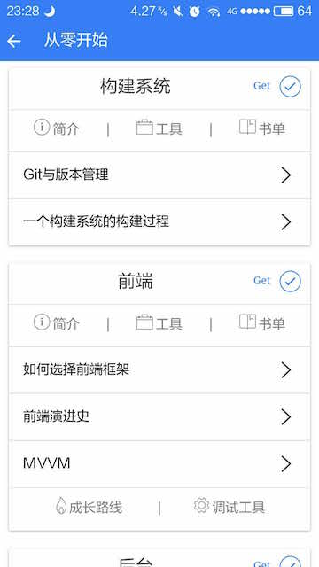
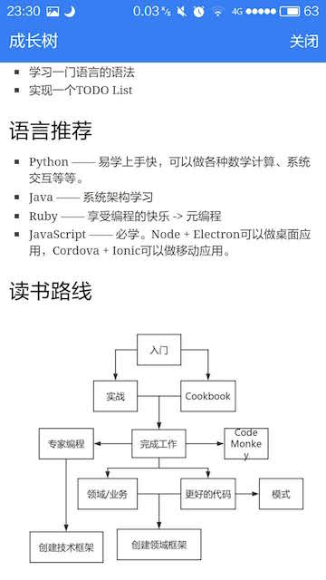
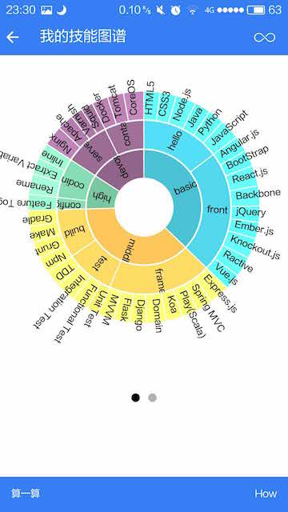

# Growth —— 成为顶尖开发者

已在**360手机助手**、**小米应用商店**、**豌豆荚**、**Google Play**等应用商店上线

直接下载：[http://fir.im/phodal](http://fir.im/phodal)

在线预览: [http://www.growth.ren/](http://www.growth.ren/)

应用截图:

  

Growth交流群(QQ): 529600394 

欢迎关注我的微信公众号: phodal

##简介

Growth来源于: 对Web应用开发的一个流程认识。

主要关注点是**Web开发的流程及其技术栈、学习路线、成长衡量**，包含：

 - 完整的Web开发流程介绍   
 - 如何写好代码——重构、测试、模式
 - Web应用的分析和部署
 - 遗留代码、遗留系统的形成
 - 每一阶段所需的技能

主要围绕下图构建:

##FAQ

**为什么没有WP和iOS版?**

- 没有iPhone和iOS开发者帐号
- 没有Windows机器的电脑(平时用的是公司的电脑)

**我可以复制吗?**

> 想法和代码是可以复制的，但是内容是不行的。

##其他

前端问题来源于: [http://markyun.github.io/2015/Front-end-Developer-Questions/](http://markyun.github.io/2015/Front-end-Developer-Questions/)

Skill Map基于: [http://bl.ocks.org/wizicer/f662a0b04425fc0f7489](http://bl.ocks.org/wizicer/f662a0b04425fc0f7489)

前端资料基于: [https://github.com/dypsilon/frontend-dev-bookmarks](https://github.com/dypsilon/frontend-dev-bookmarks)

Plugins:

    cordova plugin add https://git-wip-us.apache.org/repos/asf/cordova-plugin-inappbrowser.git
    cordova plugin add https://github.com/danwilson/google-analytics-plugin.git
    cordova plugin add cordova-plugin-app-preferences

    cordova plugin add cordova-plugin-file  //文件
    cordova plugin add cordova-plugin-file-transfer //下载
    cordova plugin add https://github.com/pwlin/cordova-plugin-file-opener2.git //安装
    cordova plugin add https://github.com/whiteoctober/cordova-plugin-app-version.git
    cordova plugin add https://github.com/EddyVerbruggen/Toast-PhoneGap-Plugin.git

``用户隐私``: 在这里会用Google Analytics来收集用户访问的页面来分析用户喜欢的功能。

##Todo

1. Tips
2. Auto Update
3. Learn Suggestion
4. Social Communication

###Thinking

1. [https://github.com/braydie/HowToBeAProgrammer](https://github.com/braydie/HowToBeAProgrammer)

2. [http://stackshare.io/](http://stackshare.io/)

3. [http://stackshare.io/featured-posts](http://stackshare.io/featured-posts)

##License

© 2015~2016 [Phodal Huang](https://www.phodal.com). This code is distributed under the CC0 1.0 Universal license. See `LICENSE` in this directory.

[待我代码编成，娶你为妻可好](http://www.xuntayizhan.com/person/ji-ke-ai-qing-zhi-er-shi-dai-wo-dai-ma-bian-cheng-qu-ni-wei-qi-ke-hao-wan/)
