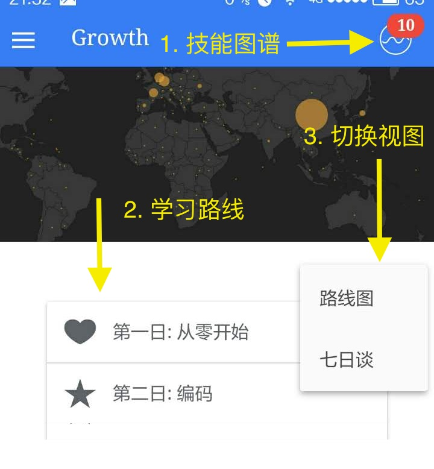

# Growth —— 成为顶尖开发者

已在各大Android应用商店发布，直接下载：[http://fir.im/phodal](http://fir.im/phodal) 在线预览: [http://www.growth.ren/](http://www.growth.ren/)

Growth交流群(QQ): 529600394，欢迎关注我的微信公众号: phodal

##简介

Growth关注于**Web开发的流程及其技术栈、学习路线、成长衡量**，如：

 - 完整的Web开发,运维,部署,维护介绍   
 - 如何写好代码——重构、测试、模式
 - 遗留代码、遗留系统的形成
 - 不同阶段所需的技能
 - 书籍推荐
 - 技术栈推荐
 - Web应用解决方案
 
###主视图
 
主页视图如下所示:

1. 技能图谱。点击右上角的图标可以进入技能图谱，技能图谱将展示现在你学到的技术栈，并且可以向你推荐未来应该学习的技术栈。图标上的10则表示你新GET到的功能点数。
2. 学习路线。学习路线是依据七日来规划的，每一日关注的点不同，如在第一天关注于如何从零开始去搭建项目。
3. 切换视图。当前有两种视图，即路线图和七日谈。
 
###七日谈模式——侧重于理论
 
七日谈模式关注于一些理论。如下图所示：

1. 右上角的简介。会介绍一些每一个事项相关的信息。
2. GET技能。用于构建技能图谱、提供成长指南。
3. 工具和书单。提供一些实用的工具，以及阅读书单等等。 
 
###路线图模式——侧重于实战
 
路线图关注于一些可以尝试开始的事项。如下图所示：

在每个Card中会包含如下的Todo List:

###菜单

向左滑动即可以完成这个事项。
 
 

1. 技能测验。用于验证我们学习的内容，以及查找补漏。
2. 读书路线。提供不同方向的书单，如前端。
3. 解决方案。提供一些现有框架的框架示例。
4. 意见和反馈。使用Github Issues来收集用户意见。 

##FAQ

**为什么没有WP和iOS版?**

- 没有iPhone和iOS开发者帐号
- 没有Windows机器的电脑

##其他

前端问题来源于: [http://markyun.github.io/2015/Front-end-Developer-Questions/](http://markyun.github.io/2015/Front-end-Developer-Questions/)

Skill Map基于: [http://bl.ocks.org/wizicer/f662a0b04425fc0f7489](http://bl.ocks.org/wizicer/f662a0b04425fc0f7489)

前端资料基于: [https://github.com/dypsilon/frontend-dev-bookmarks](https://github.com/dypsilon/frontend-dev-bookmarks)

Plugins:

    cordova plugin add https://git-wip-us.apache.org/repos/asf/cordova-plugin-inappbrowser.git 
    cordova plugin add https://github.com/danwilson/google-analytics-plugin.git // GA
    cordova plugin add cordova-plugin-file  //文件
    cordova plugin add cordova-plugin-file-transfer //下载
    cordova plugin add https://github.com/pwlin/cordova-plugin-file-opener2.git //安装
    cordova plugin add https://github.com/whiteoctober/cordova-plugin-app-version.git //For Update
    cordova plugin add https://github.com/EddyVerbruggen/Toast-PhoneGap-Plugin.git

##Todo

1. Social Communications

###Thinking

1. [https://github.com/braydie/HowToBeAProgrammer](https://github.com/braydie/HowToBeAProgrammer)

2. [http://stackshare.io/](http://stackshare.io/)

3. [http://stackshare.io/featured-posts](http://stackshare.io/featured-posts)

##License

© 2015~2016 [Phodal Huang](https://www.phodal.com). This code is distributed under the CC0 1.0 Universal license. See `LICENSE` in this directory.

[待我代码编成，娶你为妻可好](http://www.xuntayizhan.com/person/ji-ke-ai-qing-zhi-er-shi-dai-wo-dai-ma-bian-cheng-qu-ni-wei-qi-ke-hao-wan/)
