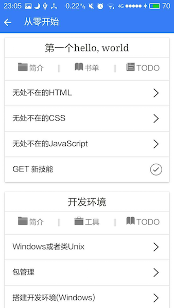
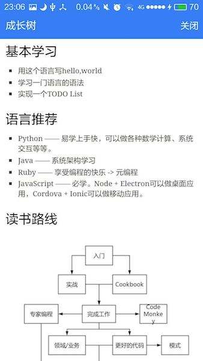

# Growth: 成为优秀的Web Developer。

App版已在**360手机助手**、**小米应用商店**、**豌豆荚**、**Google Play**等应用商店上线

在线预览版: [http://www.growth.ren/](http://www.growth.ren/)

直接下载：[http://fir.im/phodal](http://fir.im/phodal)

应用截图:

 

Growth交流群(QQ): 529600394 

关注我的微信公众号: phodal。

##简介

Growth主要关注的点是**Web开发的流程及其技术栈、学习路线**，里有啥：

 - 近乎完整的Web开发流程介绍 
 - 如何写好代码——重构、测试、模式
 - Web应用的分析和部署
 - 如何不再写遗留代码

APP来源于: 对Web应用开发的一个流程认识。

##FAQ

**为什么没有WP和iOS版?**

- 用不起iPhone和iOS开发者帐号
- 没有Windows机器的电脑(平时用的是公司的电脑)
- 以前我是用Windows Phone的

**我可以复制吗?**

> 想法和代码是可以复制的，但是内容是不行的。

**为什么APP这么卡？**

因为，它是基于Web的混合应用，为了更快的开发速度.

##其他

前端问题来源于: [http://markyun.github.io/2015/Front-end-Developer-Questions/](http://markyun.github.io/2015/Front-end-Developer-Questions/)

Plugins:

    cordova plugin add https://git-wip-us.apache.org/repos/asf/cordova-plugin-inappbrowser.git
    cordova plugin add https://github.com/danwilson/google-analytics-plugin.git
    cordova plugin add cordova-plugin-app-preferences

##Todo

1. Tips
2. SkillTree Render

## License

© 2015~2016 [Phodal Huang](https://www.phodal.com). This code is distributed under the CC0 1.0 Universal license. See `LICENSE` in this directory.

[待我代码编成，娶你为妻可好](http://www.xuntayizhan.com/person/ji-ke-ai-qing-zhi-er-shi-dai-wo-dai-ma-bian-cheng-qu-ni-wei-qi-ke-hao-wan/)
