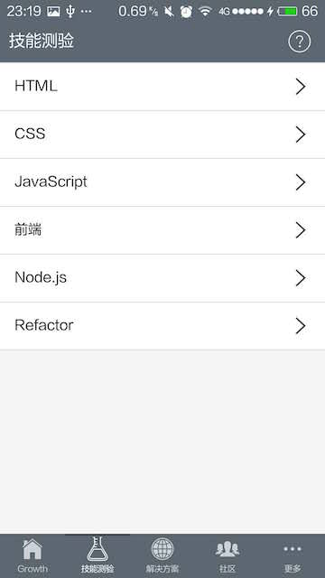
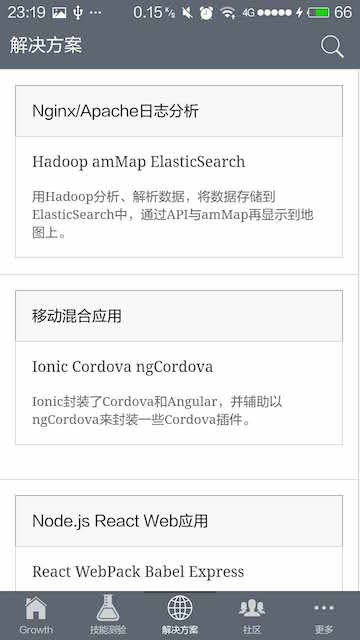
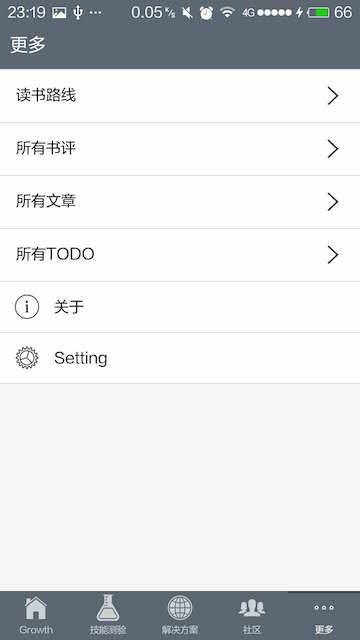
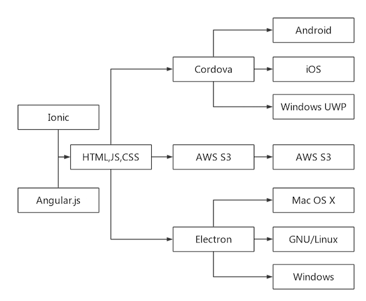

Growth —— Be Awesome Developer
---

**Android**:

Download：[http://fir.im/phodal](http://fir.im/phodal) 

(ps: 已在其他各大Android应用商店发布)

**Windows Phone**:

**iOS**:

**Waiting For Review**...

**Desktop**

[Download Page](https://github.com/phodal/growth/releases)

Powered by Electron，Support OS:

1. Mac OS X
2. GNU/Linux
3. Windows

**Web**:

Online: [http://www.growth.ren/](http://www.growth.ren/)

**Other**

QQ群: 529600394，我的微信公众号: phodal

##简介

Growth是一款专注于Web开发者成长的应用，涵盖Web开发的流程及技术栈，Web开发的学习路线、成长衡量等各方面。在这里，你将通过不断检验自己的学习成效，形成属于你自己的独一无二的个性技能图谱。

在这里你可以了解到：

 - 完整的Web开发，运维，部署，维护
 - 如何写好代码——重构、测试、模式
 - 遗留代码、遗留系统的形成

在这里你可以get到：

 - 不同阶段所需的不同技能
 - 相关书单推荐
 - 相关技术栈推荐
 - Web应用解决方案

在这里你还可以：

 - 玩玩小游戏了解技能掌握状况
 - 一键解锁新技能，形成技能图谱 
 - 一步步成为Web顶尖开发者 
 

##Setup && Development 

###Tech Stack

1. Angular.js
2. Cordova
3. Ionic
4. ngCordova
5. jQuery
6. Nools
7. D3.js
8. collide

Angular Plugins: 

1. angular-highlightjs: HighLight Code
2. angular-marked: Markdown Support 
3. angular-translate: i18n
4. angular-moment: Time i18n
5. angular-resource: HTTP Resource
6. angular-messages: Form Validate

Angular Plugins: ionic-rating, ionic-ion-tinder-cards, ionic.swipecards, ionic-filter-bar, ion-affix 

###Setup

1.Clone

    git clone git@github.com:phodal/growth.git

2.Install Deps

    npm install -g cordova
    npm install -g ionic
    ionic serve

Plugins:

App in Browser:

    cordova plugin add https://git-wip-us.apache.org/repos/asf/cordova-plugin-inappbrowser.git
    
Google Analytics     
     
    cordova plugin add https://github.com/danwilson/google-analytics-plugin.git // 
    
I18N:
   
    cordova plugin add https://git-wip-us.apache.org/repos/asf/cordova-plugin-globalization.git
    
####Android
    
Auto Update:    
    
    cordova plugin add cordova-plugin-file  //文件
    cordova plugin add cordova-plugin-file-transfer //下载
    cordova plugin add https://github.com/pwlin/cordova-plugin-file-opener2.git //安装
    cordova plugin add https://github.com/whiteoctober/cordova-plugin-app-version.git //For Update
    cordova plugin add https://github.com/EddyVerbruggen/Toast-PhoneGap-Plugin.git

####Windows Phone & Windows 10: 

Install GA SDK With NuGet

    PM>  Install-Package GoogleAnalyticsSDK 

Google Analytics:  

    cordova plugin add https://github.com/dpolivy/google-analytics-plugin#f516ba05835e6c5ce35c572a912b966949b488eb

1. [https://github.com/Microsoft/cordova-docs/blob/master/articles/getting-started/tutorial-ionic.md](https://github.com/Microsoft/cordova-docs/blob/master/articles/getting-started/tutorial-ionic.md)
2. [http://blog.vjrantal.net/2015/01/08/experiences-with-ionic-on-windows-phone-8-1/](http://blog.vjrantal.net/2015/01/08/experiences-with-ionic-on-windows-phone-8-1/) 
3. [http://www.badpenguin.org/how-to-make-your-ionic-cordova-app-to-run-under-windows-phone-8-1-and-desktop](http://www.badpenguin.org/how-to-make-your-ionic-cordova-app-to-run-under-windows-phone-8-1-and-desktop)

####Desktop

Install Electron and Run

     electron .

##其他

###Thinking

1. [https://github.com/braydie/HowToBeAProgrammer](https://github.com/braydie/HowToBeAProgrammer)

2. [http://stackshare.io/](http://stackshare.io/)

3. [http://stackshare.io/featured-posts](http://stackshare.io/featured-posts)

4. [https://www.awesomes.cn/](https://www.awesomes.cn/)

前端问题来源于: [http://markyun.github.io/2015/Front-end-Developer-Questions/](http://markyun.github.io/2015/Front-end-Developer-Questions/)

Skill Map基于: [http://bl.ocks.org/wizicer/f662a0b04425fc0f7489](http://bl.ocks.org/wizicer/f662a0b04425fc0f7489)

前端资料基于: [https://github.com/dypsilon/frontend-dev-bookmarks](https://github.com/dypsilon/frontend-dev-bookmarks)

部分书评来自于亚马逊、豆瓣。

###内容贡献者

感谢以下的内容贡献者们，结果由git-summary生成

     project  : growth
     repo age : 5 weeks
     active   : 35 days
     commits  : 901
     files    : 755
     authors  :
       893	Fengda HUANG  99.1%
         8	Le Deng       0.9

英语版:  [Le Deng](https://github.com/raydeng83)

##License

© 2015~2016 [Phodal Huang](https://www.phodal.com). This code is distributed under the CC0 1.0 Universal license. See `LICENSE` in this directory.

[待我代码编成，娶你为妻可好](http://www.xuntayizhan.com/person/ji-ke-ai-qing-zhi-er-shi-dai-wo-dai-ma-bian-cheng-qu-ni-wei-qi-ke-hao-wan/)
